# Pahtli

**Offline voice triage for community health workers (promotoras de salud) in rural Mexico.**

> *Triaje por voz, sin internet, para promotoras de salud: urgencia, centro de salud hoy o atender aquí — y a dónde ir.*

*Pahtli* is Náhuatl for "medicine, remedy" (Molina 1571, via the [Online Nahuatl Dictionary](https://nahuatl.wired-humanities.org/content/patli)).

**Live demo:** https://pahtli.vercel.app · **Status:** hackathon prototype. Clinical rules are pending review by a licensed physician. It is **not** a medical device and does not diagnose or prescribe.

---

## Problem statement

> **Because of this tool**, a promotora de salud in a rural Mexican community **will know within seconds** whether a patient needs urgent care, the health center today, or home care, and where the nearest facility is, even with no signal. **Otherwise she would decide late or by guesswork.**
>
> **We know because:**
> - **34.2 % of Mexicans (44.5 million) lacked access to health services in 2024**, 13.9 million of them in rural areas (INEGI, *Pobreza multidimensional 2024*).
> - Mexico has **2.7 practising doctors per 1,000 people** (OECD average 3.9) and **treatable mortality of 175 per 100,000** (OECD average 77) (OECD, *Health at a Glance 2025*).
> - **Rural internet use is 75.2 %, against 88.9 % urban**, and 79.3 % of phone users are on prepaid, metered data (INEGI, *ENDUTIH 2025*).
> - **Influenza and pneumonia were the 6th cause of death in 2024 (37,283 deaths)**, and under-5 mortality is 13.1 per 1,000 live births. Pahtli's rules triage both.
> - **7.36 million people speak an Indigenous language**, 866,000 of them speak no Spanish, and **20.9 %** of Indigenous-language speakers aged 15+ cannot read (26.2 % of women). That is why the tool is voice-first and not a text form.
>
> All figures, with sources, licences and what they *don't* cover, are in [`docs/data.md`](docs/data.md).

## Screenshots

All captured at 390×844 (phone), offline, by `npm run screenshots`.

| Voice capture | Follow-up question | Urgent | Health center today |
|---|---|---|---|
| 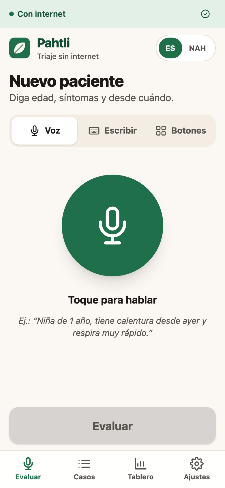 | 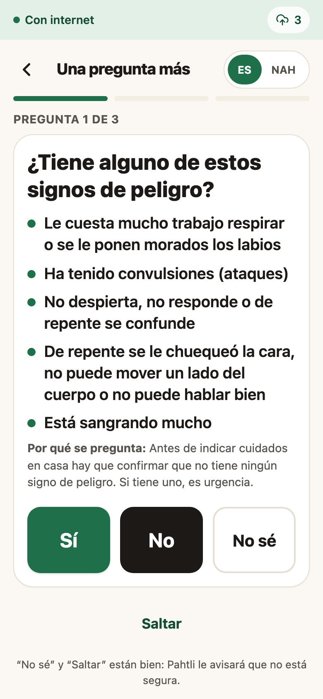 | 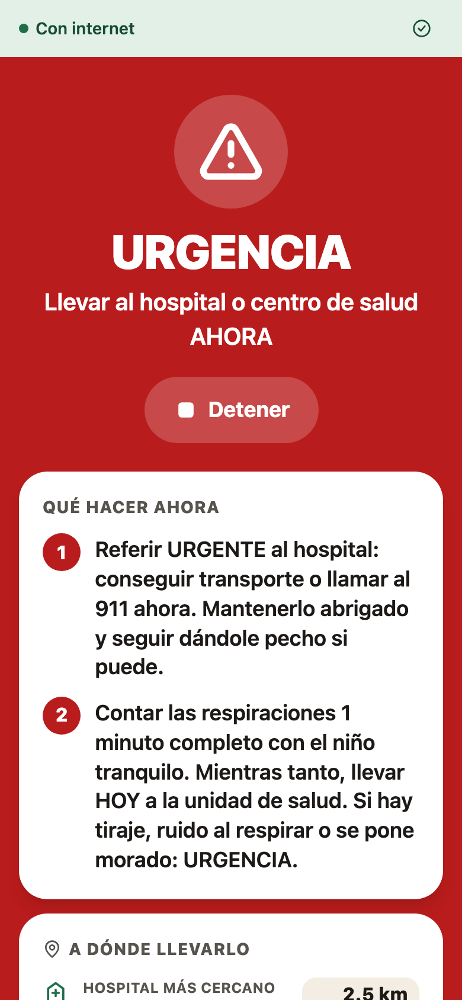 | 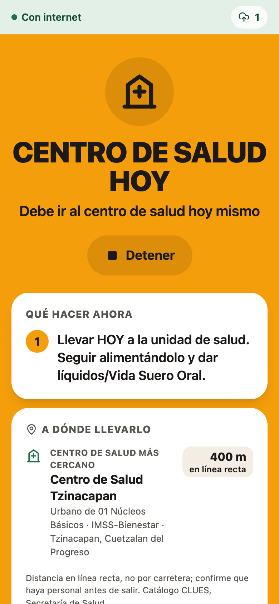 |
| **Treat here** | **"No estoy segura" (not sure)** | **Promotora decides** | **History** |
| 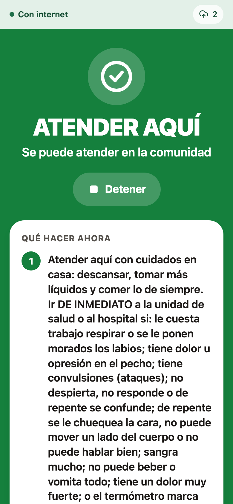 |  | 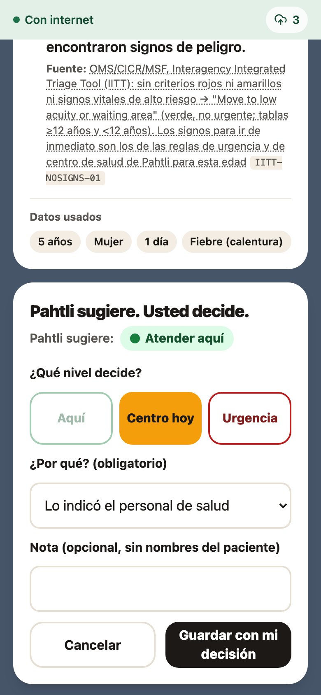 | 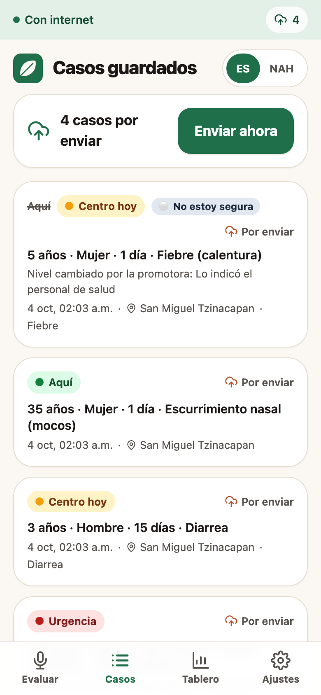 |
| **Settings / privacy** | **About the AI** | **Health-center dashboard** | |
| 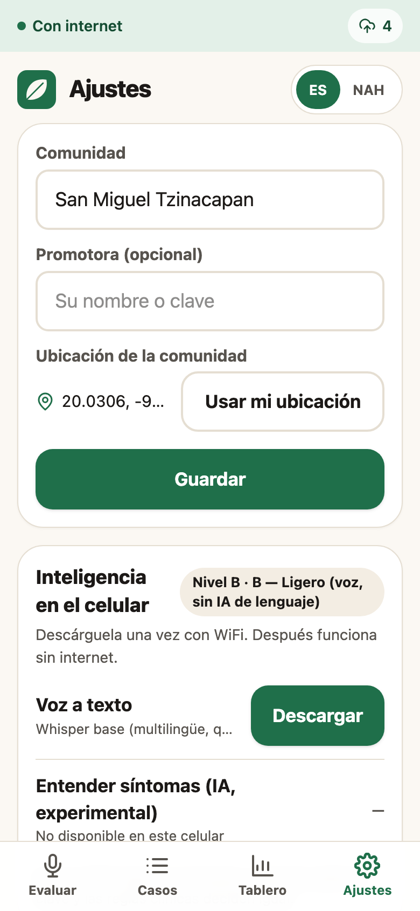 | 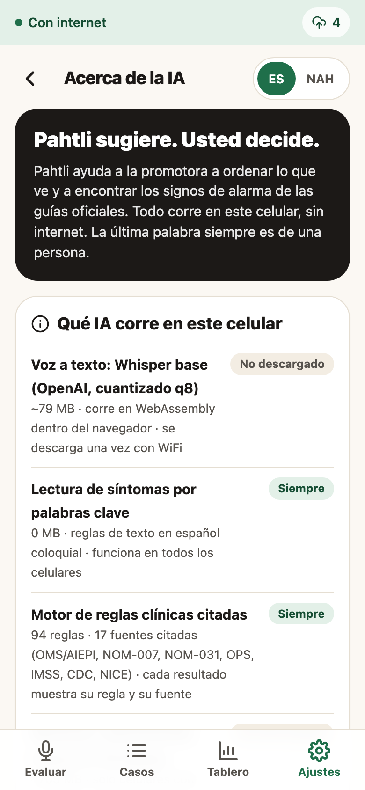 | 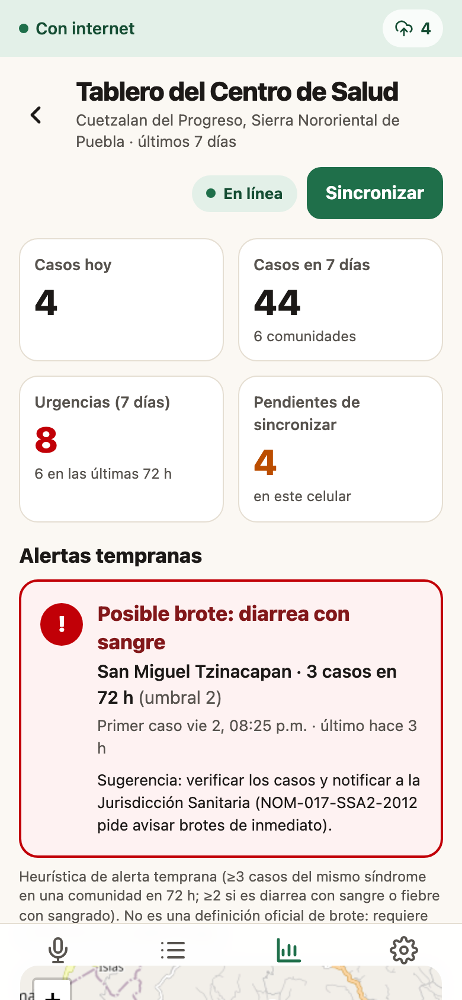 | |

## How it works

The promotora describes the patient out loud, in her own words ("tiene calentura desde hace tres días y se le hunde el pecho"). Everything up to "Save" runs **on the phone, in airplane mode**.

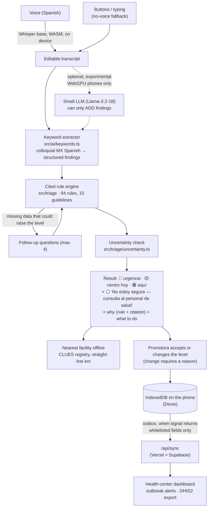

- **The model extracts, the rules decide.** Each rule cites a guideline page and the level can only go **up** from the model, never down.
- **Unknown never fires a rule.** Only an explicit "yes" or a measured number does. When a missing answer could raise the level, the engine asks for it.
- **Referral:** for *urgencia* the nearest hospital (plus nearest first-level unit as fallback); for *centro hoy* the nearest first-level unit. Uses 3,956 public facilities from the official CLUES registry (4 states), shipped as a 908 KB JSON.
- **Sync:** outbox pattern, idempotent by `case_id`, exponential backoff. The dashboard joins phone + network cases, flags syndromic clusters (e.g. ≥2 bloody-diarrhoea cases in one community in 72 h, following NOM-017's outbreak definition) and exports DHIS2 Tracker events.

Details: [`docs/ai.md`](docs/ai.md) (models), [`docs/clinical-sources.md`](docs/clinical-sources.md) (rules), [`docs/sync.md`](docs/sync.md) (sync, API, dashboard).

## Why AI (and not an SMS, a form or a web search)

| Simpler tool | Why it falls short here |
|---|---|
| **Paper or app form** | It needs reading and typing; 20.9 % of Indigenous-language speakers aged 15+ cannot read. A checkbox form also doesn't follow up: Pahtli asks *only* the question that could change the level ("¿Le contó las respiraciones?"). |
| **SMS to a doctor** | It needs signal, which is exactly what is missing at the moment of care, and a doctor on the other end. |
| **Web search / chatbot** | It needs internet, and it gives uncited, unbounded answers. Pahtli gives one of three levels, the guideline behind it, and the nearest facility. |
| **Rules only, no AI** | Rules need structured findings. The AI layer turns *spoken colloquial Spanish* ("se le hunde el pecho", "anda manchando", "no se pega al pecho") into those findings. |

**Honest note on what the AI adds.** Speech recognition (Whisper) is the essential ML part. The findings extractor that ships is deterministic keyword matching, which is auditable and works on every phone. We tested small in-browser LLMs (Qwen2.5-0.5B, Gemma-3-1B, Llama-3.2-1B): **none improved measurably on the keyword extractor**, so the LLM is an off-by-default experiment on WebGPU phones and can only *add* findings ([`docs/ai.md`](docs/ai.md) §4). Buttons remain available for any phone without a microphone.

## Small AI constraints

| Constraint | What Pahtli does |
|---|---|
| **Device** | Installable PWA in the phone's browser; no app store. Tier detection at start-up (`src/ai/capability.ts`): **A** WebGPU (voice + optional LLM), **B** WASM + mic (voice), **C** anything else (buttons + typing + rules). Triage works on all three. |
| **Offline** | Triage, follow-up questions, referral, history, PIN and the "No estoy segura" check work with **no connection** (Playwright test in airplane mode). Voice works offline after one download on Wi-Fi. Only sync and the dashboard map tiles need internet. |
| **Model size** | **Voice: ~106 MB total**, made of Whisper base q8, 79 MB, plus ONNX Runtime WASM, 26.9 MB (6.8 MB gzip), self-hosted. **Extractor + rules: 0 MB model** (initial JS 580 KB, 180 KB gzip). **Facility registry: 908 KB.** Optional LLM: 705 MB download, not needed. |
| **Latency** | Extraction + triage: **0.47 ms mean, 1.04 ms p95** (eval, Node). Whisper base: **2.2–2.4 s per 4–6 s clip** (Chromium, single-thread WASM, Apple Silicon Mac). Phone latency: see [Evidence](#evidence-it-works). |
| **Local language** | **Mexican Spanish**: voice, colloquial vocabulary and the whole UI. **Náhuatl: UI toggle exists, but only 4 words are shown in Náhuatl** (*quema* yes, *amo* no, *Pahtli*, *tlazohcamati* thanks), each from an academic dictionary. Everything else stays in Spanish until a native speaker of the local variant reviews it ([`src/i18n/NAH_PENDING.md`](src/i18n/NAH_PENDING.md)). **No Náhuatl voice input.** |

**Less-supported languages, honestly.** Whisper has no Náhuatl, so a Náhuatl speaker talking directly to Pahtli would get wrong Spanish text. We therefore don't offer Náhuatl voice; the promotora, usually bilingual, is the bridge. Meta MMS has adapters for 13 Nahuatl variants, including Sierra Norte de Puebla (`azz`) and the Huasteca (`nch`, `nhe`, `nhw`). But it is ~965 M parameters (~3.9 GB fp32), is licensed **non-commercial**, and is trained on read religious text. Common Voice has 0 h for `azz` and `nhe`. The roadmap is in [`docs/data.md`](docs/data.md) §C.

## Responsible AI & safety

**1. Rules decide; the model can only escalate.** `final_level = max(rules, model hint)`. The 94 rules are deterministic TypeScript, each linked to a guideline page. Unit tests check that the model never lowers a level, that an unknown never fires a rule, and that no rule contains a drug dose.

**2. "No estoy segura — consulta al personal de salud" (the fail-safe).** A fourth, grey result appears instead of a confident colour when:
- nothing was recognised (`no_findings`);
- the transcript is short or garbled;
- the age is missing *and* some plausible age would raise the level;
- she answered "No sé" or skipped a question that could raise the level;
- the result would be "Atender aquí" but the danger-sign check was not answered "No" (`danger_signs_unchecked`): before any green result the engine asks one yes/no question listing the danger signs for the patient's age;
- the optional LLM and the keywords disagree;
- a baby under 2 months or a pregnancy has few findings.

The reasons are shown in plain Spanish. The rules' level stays visible: the fail-safe never lowers it. In the eval it fires on **8/8** cases built to lack critical data.

**3. A human makes the final call.** The result is a suggestion. Nothing is saved until the promotora taps **"Estoy de acuerdo · Guardar caso"** or picks a different level. **Changing the level requires a reason** from a closed list. Both the suggestion and her decision are stored and synced, and the dashboard flags "cambió la promotora". The result screen states *"Herramienta de apoyo. No sustituye la valoración médica."*

**4. Privacy: where data sits, who reads it, a lost or shared phone.**

| Question | Answer |
|---|---|
| Where does data sit? | On the phone (IndexedDB). No patient name, ID or phone number is ever asked for. |
| What leaves the phone? | Only whitelisted, structured fields (coarse age, sex, yes/no findings, level, her decision code, rule IDs, community, time). **The transcript, her free-text note and the reason sentences never leave.** Coordinates are rounded to ~1 km on the phone *and* again on the server. Covered by unit and e2e tests. |
| Who reads synced data? | Health-center staff with the dashboard key (`PAHTLI_DASHBOARD_KEY`). Without the key the API returns aggregate counts only, or `401` if a key is configured. The Supabase table has RLS forced and no public policies: only the server functions can touch it. |
| Lost or shared phone? | Optional 4-digit **PIN** (PBKDF2-SHA-256, 100,000 iterations; only a salted hash is stored), relock after 5 min in the background, lockout after 5 failed tries. **Auto-delete** of *sent* cases after 7, 30 or 90 days (unsent cases are never auto-deleted). **"Borrar todos los datos"** in Settings. |
| Limits we state | The PIN stops casual access but **does not encrypt** the data at rest. Not assessed against Mexico's personal-data law or NOM-024-SSA3-2012. |

**5. API security.** `POST /api/sync` enforces an enrollment token (`x-pahtli-device`, constant-time compare) when `PAHTLI_SYNC_TOKEN` is set. The live demo does not set it: a shared token inside a PWA bundle is public anyway, so we rely on strict validation and are explicit that production needs per-device keys. Strict schema: any unknown field (e.g. `transcript`) rejects the case. Reasons accept only short codes, never free text. Values are clamped. Limits: 200 cases or 256 KB per request, 30 requests/min per IP. Known gaps: the token is shared per deployment (not per phone), a `VITE_` token is public, and the rate limit is in memory ([`docs/sync.md`](docs/sync.md)).

## Clinical sources

- **94 rules from 15 primary sources**, each downloaded and read before writing the rules that use it: WHO/UNICEF IMCI 2014 and the 2019 young-infant booklet, WHO/UNICEF *Caring for the sick child in the community* (iCCM), NOM-031-SSA2-1999 (child health), NOM-007-SSA2-2016 (pregnancy, birth, newborn), IMSS GPC prenatal care, WHO PCPNC 2015, PAHO dengue algorithms 2020, WHO/ICRC/MSF IITT (adult and paediatric), CDC stroke and heart-attack, NICE NG143, WHO diarrhoea manual 2005, WHO mhGAP 2.0 (suicide risk) and IMSS measles.
- Each rule is marked **verbatim** or **adapted**, with the page and a short quote. The rule-to-source table is generated from the code: [`docs/clinical-sources.md`](docs/clinical-sources.md).
- Where sources disagree, the team made a provisional recommendation for each of the 19 open decisions using written principles (Mexican NOM first; community-level guideline over clinic-level; the more protective level only when that source applies to community care). See `docs/decisiones-clinicas.md`; all are pending the physician's review.
- **Pending review by a physician: Dra. Ines.** Until she signs off, nothing here should be called "clinically validated".
- **Out of scope:** dosing and treatment, chronic disease, scorpion stings (the NOM was cancelled; no current source yet), malaria, ear infections, TB, anything needing labs or vital-sign devices.

## Evidence it works

### Triage evaluation (`npm run eval`)

130 **synthetic** vignettes in colloquial Mexican Spanish, written by the team and labelled from the guidelines. The pipeline is the same one every phone has, with no LLM: text → keyword extractor → rules → uncertainty check. 95 % CIs are Wilson.

| Split | Role | Accuracy | **Urgent cases under-triaged** | …silently (no question, no warning) | Over-triage | Referral sensitivity |
|---|---|---|---|---|---|---|
| dev (60) | used for tuning | 98.3 % (CI 91–100) | 0/22 (CI 0–15 %) | 0/22 | 1.7 % | 100 % (42/42) |
| test_v1 (30) | old held-out, now regression | 100 % (CI 89–100) | 0/11 (CI 0–26 %) | 0/11 | 0 % | 100 % (21/21) |
| **test_v2 (40)** | **current held-out** | **92.5 % (CI 80–97)** | **3/16 = 18.8 % (CI 7–43 %)** | **1/16** | 0 % | 96.7 % (29/30, CI 83–99) |

**How to read test_v2, honestly:**
- It was written and **frozen by hash before** the round-2 extractor changes, and its per-case failures were hidden during development. Before those changes it scored **62.5 % with 10/16 urgent cases under-triaged**, the worst number in the project.
- The same author wrote the vignettes and the new vocabulary, and 19 new phrases appear word-for-word in test_v2. Without those phrases: **85 % accuracy, 6/16 urgent cases under-triaged (CI 19–61 %)**. **The defensible claim is 85–92.5 % accuracy and 3–6 of 16 urgent cases under-triaged, on team-written text.**
- Every test_v2 miss is an **extraction** miss: on the annotated findings the rules get **36/36** right.
- Symptoms extracted correctly on test_v2: **94.6 % (70/74)**. The only silent miss, T2-V13, is a negation error ("no puede ni hablar de lo que le cuesta respirar"). It was left unfixed on purpose to avoid tuning on the test set.
- **Fail-safe:** it fires on 8/8 data-missing cases. It is noisy on 24/122 complete cases (20 %) when the in-app question flow is simulated, and on 60/122 if she skips every question.
- A clean measure needs a **test_v3 written by someone else**, the physician or real promotora transcripts.

Full method, ablation and failure analysis: [`docs/eval.md`](docs/eval.md) · per-case results: [`eval/results.md`](eval/results.md).

### Voice

On 12 synthetic Mexican-Spanish clips (macOS TTS, 2 voices), Whisper base gave **the same triage level as the reference text in 12/12**, after one measured fix: Whisper heard "le **huele** el pecho" for "le duele". Without the fix, 2 urgent cases fell to "aquí". Whisper's accuracy on real rural or Indigenous-accented speech is **unmeasured**, by OpenAI and by us ([`docs/ai.md`](docs/ai.md) §3).

### Automated tests

- `npx vitest run`: **423 tests in 11 files** pass. They cover the rules (at least one positive case per rule, plus a coverage guard), the extractor (including adversarial negations), uncertainty, sync whitelist, PIN, retention, DHIS2 export and eval integrity.
- `npm run e2e` (Playwright, Pixel 7 profile):
  1. **Full triage in airplane mode**, then sync when the signal returns.
  2. **"No sé" → the grey "No estoy segura" screen**, no save before she confirms, an override blocked without a reason, and the nearest facility shown. The test also checks the payload that reaches the server: no note, no transcript, rounded location.
- Opt-in: `E2E_VOICE=1` (Whisper loads from cache and transcribes offline) and `SCREENSHOTS=1` (fails if any page scrolls sideways at 390 px).

### Device tests

| Device | Result |
|---|---|
| Chromium on Apple Silicon Mac | Tier A detected; Whisper base 2.2–2.4 s per clip; Llama-3.2-1B 0.48–0.76 s per extraction |
| iPhone 14 Pro (Safari) | TBD |
| Low-end Android | TBD |

## Data sources

| Data | Source · licence | Used for | What it does **not** cover |
|---|---|---|---|
| Clinical guidelines | WHO, PAHO, Secretaría de Salud (NOMs), IMSS, CDC, NICE (public or free with attribution) | The 94 rules | Mostly children under 5 and pregnancy. No chronic disease, labs or vital-sign devices. iCCM treatment is deliberately left out. |
| Facility registry | **CLUES**, DGIS / Secretaría de Salud, Aug 2026 snapshot; "no existen restricciones para su uso" | Offline referral: 3,956 public facilities in Puebla, Hidalgo, San Luis Potosí, Veracruz | **Whether anyone is there today**, opening hours, road distance or travel time (we use straight-line km), eligibility. Only 4 states. |
| Speech model | **Whisper** (OpenAI), code MIT, weights Apache-2.0; 11,100 h of Spanish training audio (not released) | Voice to text | Rural, noisy, spontaneous or Indigenous-accented speech; no Náhuatl |
| Optional LLM | Llama-3.2-1B-Instruct (Llama 3.2 licence) | Experimental extra findings | Training data not public; no measured gain |
| Eval set | **Synthetic**, written for this project (repo licence) | Metrics above | Real patients, real voices, code-switching. If we misread a guideline, the eval shares the mistake. |
| Map tiles | OpenStreetMap, ODbL 1.0 | Dashboard map only | Not offline; uneven rural coverage |
| Dashboard demo cases | **Synthetic**, tagged "Demo", can be hidden | Showing outbreak alerts | Not used in any metric |
| Problem statistics | INEGI, OECD, World Bank WDI, SSA dengue bulletins (CC BY 4.0 / public) | Problem statement | No verified rural-vs-urban doctor density, travel time to care, or national count of promotores |

No real patient data was used anywhere. Full detail: [`docs/data.md`](docs/data.md).

## Scalability

- **Rules are data.** Each rule is a typed object with level, criteria, citation and Spanish text (`src/triage/rules/`). Adapting to another country means swapping or adding rule files for its national guidelines; the engine, extractor interface, UI and tests stay the same. The base is WHO IMCI and IITT, which most countries already adapt.
- **Facility registries.** `scripts/build-facilities.py` (Python standard library only) turns the monthly CLUES file into the referral JSON. Adding a Mexican state means changing a filter. Other countries need any registry with coordinates and level of care, such as national master facility lists.
- **Fits existing health information systems.** History exports **DHIS2 Tracker events** (event program, verified against the DHIS2 docs). The program and data-element UIDs are placeholders each state replaces with its own.
- **Cost.** It runs in the browser, needs no app store, and its static hosting and serverless API scale to zero. Models download once on Wi-Fi and are then cached.
- **Languages roadmap:**
  1. Record consented promotora and patient speech in the local variant, e.g. `azz` in Cuetzalan or `nch`/`nhe` in Huejutla.
  2. Contribute it to Common Voice (CC0).
  3. Fine-tune an MMS adapter or Whisper-tiny/base to fit the same ~100–150 MB budget.
  4. Ship only if red-flag sub-triage stays at the Spanish baseline.

  Native-speaker translation of the UI comes first.

## Tech stack

- **App:** Vite 8, React 19, TypeScript, Tailwind CSS v4, `vite-plugin-pwa` (Workbox, offline precache).
- **On-device AI:** `@huggingface/transformers` 4.3 (Whisper base q8, ONNX Runtime WASM in a Web Worker), `@mlc-ai/web-llm` (optional LLM, WebGPU).
- **Data:** Dexie (IndexedDB), outbox sync.
- **Backend:** Vercel Functions (`api/sync.ts`, `api/cases.ts`), Supabase Postgres (RLS forced).
- **Dashboard:** Leaflet / react-leaflet, OpenStreetMap.
- **Quality:** Vitest, Playwright, oxlint, `tsx` eval runner.

## Setup

Requires Node 20.19+ or 22.12+ (Vite 8).

```bash
npm ci
npm run dev           # http://localhost:5173 (no /api routes; sync retries with backoff, as designed)
npm test              # vitest: unit + eval integrity
npm run eval          # triage eval, writes eval/results.{json,md}
npm run e2e           # Playwright: builds, serves on :4173, runs the offline tests
npm run screenshots   # regenerates docs/screenshots/
npm run build         # tsc -b && vite build → dist/
```

To exercise `/api/*` locally use `vercel dev`.

**Server environment variables** (Vercel → Settings → Environment Variables). Never prefix them with `VITE_`:

| Variable | Purpose | If missing |
|---|---|---|
| `SUPABASE_URL` | Supabase project URL | No database: sync answers `demo: true`, dashboard shows local and demo data |
| `SUPABASE_SERVICE_ROLE_KEY` | Server-side DB access | Same as above |
| `PAHTLI_SYNC_TOKEN` | Enrollment token phones send as `x-pahtli-device` | Demo mode: sync validates but **stores nothing** |
| `PAHTLI_DASHBOARD_KEY` | Key staff enter to see individual cases | `/api/cases` returns aggregate counts only |

**Database:** run [`docs/supabase.sql`](docs/supabase.sql) in the Supabase SQL editor. It is idempotent and also migrates older tables. Optional demo data: `PAHTLI_SYNC_TOKEN=… npx tsx scripts/seed-remote.ts https://<your-app>.vercel.app`.

On the phone, enter the enrollment token in **Ajustes → Envío al centro de salud**. `VITE_PAHTLI_SYNC_TOKEN` exists for demos only; it ends up in public JavaScript.

## Limitations & what's next

**Known limitations**
- **Clinical review pending.** 19 provisional clinical decisions (`docs/decisiones-clinicas.md`) await the physician. Known gaps:
  - An adult with fever for 7+ days gets "Atender aquí" (the prolonged-fever rule covers children under 5 only).
  - Ear pain or discharge has no rule; it only triggers the fail-safe.
- **Evidence is synthetic and team-written.** The held-out set is only "nearly" held out (see above). One silent under-triage remains (T2-V13).
- **The colloquial vocabulary is not validated with promotoras**, and broader vocabulary raises false-positive risk on long, rambling real speech.
- **Not yet tested on a real phone** (iPhone or low-end Android). The iOS audio path follows the Web Audio documentation only.
- **The fail-safe still fires on ~20 % of complete cases** in the simulated flow. Promotoras might learn to ignore it.
- **Security gaps:**
  - the PIN does not encrypt data;
  - the sync token is shared per deployment;
  - the rate limit lives in memory;
  - in tiny communities aggregate counts can point to a person, so the dashboard key must be set in real use.
- Straight-line distance to facilities; no opening hours or staffing.
- Náhuatl UI is 4 words; no Náhuatl voice. The UI copy mixes *tú* and *usted*.

**Next**
1. Physician sign-off on the provisional decisions in `docs/decisiones-clinicas.md`, and fixes for the clinical gaps above.
2. **test_v3** from outside the team: physician-written vignettes, then consented, anonymised promotora transcripts.
3. Field pilot with promotoras in the Sierra Norte de Puebla: vocabulary, fail-safe noise, real-phone latency.
4. Per-phone enrollment keys (revocable), encryption at rest, shared rate limit.
5. CLUES opening hours, and road travel time where data exists.
6. Native-speaker Náhuatl UI, then the speech roadmap above.

## Team

**Isai Brandon Garcia**, Tampico, Tamaulipas, México. Built with [Claude Code](https://claude.com/claude-code).

## License

[MIT](LICENSE). Third-party data and models keep their own licences (see [Data sources](#data-sources)).
